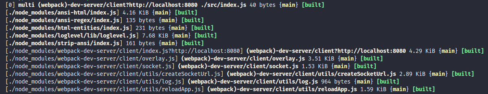

# Instalação e configuração do ambiente

Crie e acesse um diretório onde irá trabalhar. Execute o comando para iniciar o package.json

```
yarn init -y
```

O Próximo passo, vamos instalar os pacotes necessários para trabalhar com o [Babel](https://babeljs.io/) e o [Webpack](https://webpack.js.org/), para isso execute o comando abaixo para adicionar os pacotes como dependencias de desenvolvimento:

```
yarn add @babel/core @babel/preset-env @babel/preset-react webpack webpack-cli babel-loader -D
```

Agora vamos instalar o React e a biblioteca React-DOM (Estas serao instaladas como dependencias normais e não de Dev)

```
yarn add react react-dom
```

Com todas as ferramentas instaladas, agora podemos configurar o Babel e o webpack.

Inicialmente, crie um arquivo **_babel.config.js_** na raiz do seu projeto. Com o conteúdo apresentado abaixo:

```javascript
// utilizamos a sintaxe antiga para a exportação
module.exports = {
  presets: [
    // altera as funcionalidades que o navegador ainda nao entende no JS
    // (Ex.: import, export, classes, arrow functions, etc )
    '@babel/preset-env',
    // altera as funcionalidades que o navegador ainda nao entende no React
    // (Ex.: JSX)
    '@babel/preset-react'
  ]
};
```

Antes de configurar o Webpack, é necessário ter em mente que os arquivos de nosso projeto irão ficar em uma pasta e os arquivos transpilados e convertidos para forma que o navegador entenda, ficarão em uma outra pasta. Usaremos a pasta **src** para arquivos de projeto e **public** para os arquivos convertidos. Então crie estas pastas no diretório raiz do projeto.

Crie na raiz do projeto a pasta e o arquivo **src/index.js** e adicione o conteúdo abaixo no arquivo **index.js**

```javascript
const soma = (a, b) => a + b;

alert(soma(1, 3));
```

Este conteúdo está utilizando arrow functions, o que ainda não é entendido por todos os browsers, e será nosso código de exemplo para verificar se tudo irá funcionar corretamente.

Após configurar o Babel, precisamos configurar o Webpack. Crie um arquivo **_webpack.config.js_** e insira o seguinte conteúdo de configuração.

```javascript
const path = require('path');

module.exports = {
  entry: path.resolve(__dirname, 'src', 'index.js'),
  output: {
    path: path.resolve(__dirname, 'public'),
    filename: 'bundle.js'
  },
  module: {
    rules: [
      {
        test: /\.js$/,
        exclude: /node_modules/,
        use: {
          loader: 'babel-loader'
        }
      }
    ]
  }
};
```

Após configurar nossas dependencias, vamos criar um script em nosso **package.json** para fazer o build de nosso código. Adicione o seguinte trecho a seu **package.json**

```javascript
  "scripts": {
    "build": "webpack --mode development"
  },
```

Salve o arquivo e execute o comando abaixo em seu terminal.

```javascript
yarn build
```

Ao executar este comando, veremos que o arquivo **bundle.js** será criado na pasta **public**. Ao abrir o arquivo e ir no final dele, vamos ver que nossa funçao de soma foi convertida em uma função versao tradicional do javascript.

Isso tudo é importante pois podemos usar as features mais novas do JS sem medo do navegador nao rodar.

crie um arquivo **index.html** e importe o bundle.js dentro dele. rode o arquivo no navegador e veja que a função de soma será executada

- index.html

```html
<!DOCTYPE html>
<html lang="en">
  <head>
    <meta charset="UTF-8" />
    <meta name="viewport" content="width=device-width, initial-scale=1.0" />
    <meta http-equiv="X-UA-Compatible" content="ie=edge" />
    <title>Everton REACT</title>
  </head>
  <body>
    <script src="./bundle.js"></script>
  </body>
</html>
```

O próximo passo é instalar uma dependência que faz com que toda modificação feita no código seja já atualizada no navegador. Algo que trabalha semelhante ao nodemon no nodeJS.Para instalar essa dependencia em modo de desenvolvimento, execute o comando abaixo:

```js
yarn add webpack-dev-server -D
```

Após a instalação, devemos acertar nosso webpack.config.js para receber a configuração do devServer, veja abaixo como fica

```js
const path = require('path');

module.exports = {
  entry: path.resolve(__dirname, 'src', 'index.js'),
  output: {
    path: path.resolve(__dirname, 'public'),
    filename: 'bundle.js'
  },
  devServer: {
    contentBase: path.resolve(__dirname, 'public')
  },
  module: {
    rules: [
      {
        test: /\.js$/,
        exclude: /node_modules/,
        use: {
          loader: 'babel-loader'
        }
      }
    ]
  }
};
```

Após essa configuração iremos também adicionar mais um script em nosso package.json . Veja abaixo:

```js
  "scripts": {
    "build": "webpack --mode production",
    "dev": "webpack-dev-server --mode development"
  },
```

> Obs.: --mode development serve para deixar nosso bundle.js legivel. Se utilziarmos --mode production, nosso bundle.js será minificado.

Agora, rodando o comando:

```js
yarn dev
```



Podemos verificar que ao executar o comando, é fornecido o endereço e a porta em que a aplicação está rodando. No caso da imagem acima, http://localhost:8080 .
Acessando o caminho, percebemos novamente que o comando executou corretamente. A grande diferença é que se você alterar algo dentro da pasta **src** e salvar, o devServer já atualiza o navegador com os valores alterados.

Neste ponto temos o ambiente preparado para trabalhar com o React. Bora Codar!
