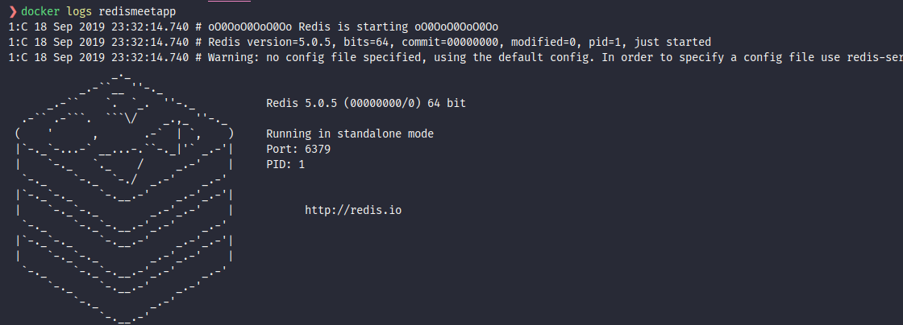
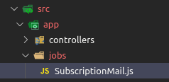
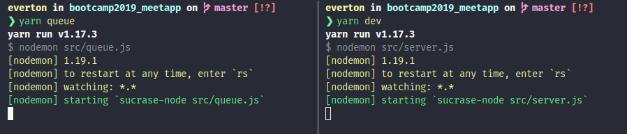

# Configurando Filas com Redis

**Objetivo**: Criar uma fila de envio de emails diminuindo o tempo de resposta no momento do envio.

**O QUE É [REDIS](http://redis.io) ?** - É um banco não relacional Chave/Valor. Diferente do MongoDB ele não permite Schemas, mas apenas chave e valor, o que o torna muito mais performático.

Como iniciar um container **[REDIS](http://redis.io)** ?

```
 docker run--name redismeetapp -p 6379:6379 -d -t redis:alpine
```

Para verificar os logs do container basta utilizar:

```
docker logs redismeetapp
```



Neste ponto, podemos criar nosso arquivo de configuração que será utilizado mais tarde para enviar as filas para o servidor do Redis. Crie o arquivo _**redis.js**_ na pasta config. O conteúdo de nosso arquivo ficará parecido com o arquivo abaixo:

```javascript
export default {
  host: '127.0.0.1', // host em que está rodando o servidor
  port: 6379 // porta do redis
};
```

Após a instalação é necessário instalar um pacote que auxilia o node a trabalhar com filas com jobs em background, o **[BeeQueue](https://bee-queue.com/)**.

Comparados a outros pacotes que tem a mesma função, o BeeQueue não é tão completo porém tem mais performance além de ajudar a controlar novas tentativas de envio. Por exemplo, caso queira controlar prioridades no envio do e-mail, talvez o **[Kue](https://github.com/Automattic/kue)** seja um pacote mais recomendado.

Para instalar o pacote **[BeeQueue](https://bee-queue.com/)** usamos o código:

```
yarn add bee-queue
```

Nesto ponto, devemos criar o arquivo _**Queue.js**_ na pasta _**lib**_. Neste arquivo vamos configurar tudo que será configurado em nossa fila.

O arquivo segue a seguinte estrutura inicial

```javascript
import Bee from 'bee-queue'; // import o Bee-queue

class Queue {
  // definimos a classe
  constructor() {
    // método construtor

    // cada tipo de job terá sua própria fila,
    // por isso criamos este objeto vazio
    this.queues = {};

    this.init(); // Chamada do Método nicializador da classe
  }

  // Chamada do Método nicializador da classe
  init() {}
}

export default new Queue();
```

Neste ponto devemos entender que para cada tipo de fila,iremos criar um tipo de job e iremos importar como fizemos nos models.

Crie a pasta **jobs** dentro da pasta **app**. Crie o arquivo que contém a classe do job de envio de email. A estrutura de pastas fica assim.



Nosso Job de envios de email ficará com a seguinte estrutura.

```javascript
class SubscriptionMail {
  // retorna chave que identifica qual o job;
  get key() {
    return 'SubscriptionMail';
  }

  // função responsável por enviar o email.
  async handle() {}
}

export default new SubscriptionMail();
```

Após colocar as funções de envio de email no método _handle()_ nosso arquivo fica parecido com o abaixo:

```javascript
import { format } from 'date-fns';
import pt from 'date-fns/locale/pt';
import Mail from '../../lib/Mail';

class SubscriptionMail {
  get key() {
    return 'SubscriptionMail';
  }

  async handle({ data }) {
    const { signin } = data;

    await Mail.sendMail({
      to: `${registered.organizer} <${registered.organizer_mail}>`,
      subject: `Inscrição de ${registered.user.name} no meetup ${registered.meetup}`,
      template: 'register',
      context: {
        organizer: registered.organizer,
        user: registered.user,
        title: registered.meetup,
        date: registered.meetup_date
      }
    });
  }
}

export default new SubscriptionMail();
```

Perceba que em handle() estamos fazendo uma desestruturação da variavel _data_ que será enviada por nós no nosso arquivo de filas (_Queue.js_)

Nosso arquivo _Queue.js_ neste momento receberá os métodos que irão elaborar a fila para ser executa. Veja como fica:

```javascript
import Bee from 'bee-queue';
import SubscriptionMail from '../app/jobs/SubscriptionMail'; // importo o arquivo da classe do job
import redisConfig from '../config/redis'; // importação da configuração do redis

// variavel que representa os jobs à serem executados
const jobs = [SubscriptionMail];

class Queue {
  constructor() {
    this.queues = {};

    this.init();
  }

  // O método init() percorre nossos jobs e cria uma fila para cada item contendo
  // a chave do job e o seu método handle e iniciar o registro da fila no redis.

  init() {
    jobs.forEach(({ key, handle }) => {
      this.queues[key] = {
        bee: new Bee(key, {
          redis: redisConfig
        }),
        handle
      };
    });
  }

  // O método add() é responsável por criar o item dentro da fila no redis
  add(queue, job) {
    return this.queues[queue].bee.createJob(job).save();
  }

  // O método processQueue() percorre  todos os jobs
  // restagando a fila e o que tem de fazer em sua execução (método handle()
  // toda vez que adicionar uma fila no redis pelo metodo add(), este metodo executa em background a execução da tarefa do metodo , no caso o metodo handle de cada tarefa)
  processQueue() {
    jobs.forEach(job => {
      const { bee, handle } = this.queues[job.key];
      bee.process(handle);
    });
  }
}

export default new Queue();
```

Neste instante vamos até a classe que enviará o email, no meu caso **SubscriptionController.js**. Até então estamos importanto a classe Mail diretamente, porém esta foi importada em nosso job (no meu caso **SubscriptionMail.js**) que por sua vez foi importada em **Queue.js**, logo vamos retirar a importação do Mail.js e vamos importar o Queue.js que contém todos os métodos de fila e importação da biblioteca de envio de email já configurada. Devemos também importar o Job que será utilizado nessa fila. A importação no Controller Fica mais ou menos assim :

```javascript
import SubscriptionMail from '../jobs/SubscriptionMail';
import Queue from '../../lib/Queue';
```

Ainda em nosso Controller que envia o email, devemos Adicionar o método add() de nossa fila para enviar os dados para que seja executado o job. A função de envio de email fica da seguinte forma.

```javascript
Queue.add(SubscriptionMail.key, {
  registered: {
    organizer: meetup.User.name,
    organizer_mail: meetup.User.email,
    meetup: meetup.title,
    meetup_date: formattedDate,
    user: user.name
  }
});
```

Agora que temos tudo no lugar, vamos criar um arquivo que funcionará em outro contexto executando nossa fila, desta forma essa funcionalidade fica separada sem impactar na aplicação. Para isto crie um arquivo _**queue.js**_ dentro da pasta _src_ (no mesmo nível em que está o arquivo _**app.js**_). Este arquivo ficará com o seguinte conteúdo.

```javascript
import Queue from './lib/Queue';

Queue.processQueue();
```

Agora para facilitar a execução de nossos contextos diferentes, vamos criar um script para que o sucrase possa rodar o arquivo _**queue.js**_. Para isso adicione o script queue na parte dos script do seu package.json, conforme o exemplo abaixo.

```javascript
  "scripts": {
    "dev": "nodemon src/server.js",
    "queue": "nodemon src/queue.js"
  }
```

Agora basta abrir mais uma janela no seu terminal e rodar os comandos para iniciar cada um de nossas aplicações. Uma é nossa api e a outra basicamente fica processando a fila quando existe algo na mesma.



Agora é só testar e partir pro abraço o/
